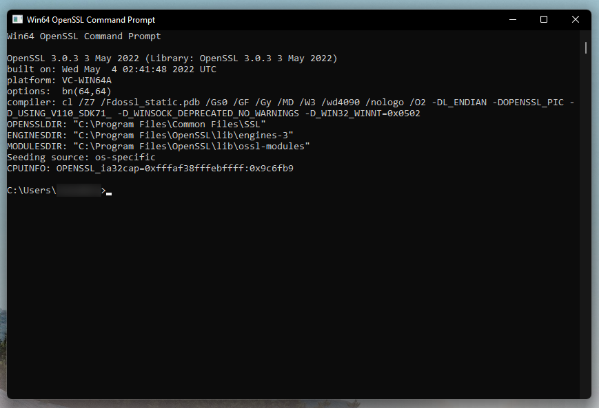

> L01-02

# Create Managed HSM

In this module we will set up the following Azure resources

| Resource | Description |
| -- | -- |
| Resource Group | Container for Azure resources |
| Managed HSM | Hardware Security Module to store encryption keys |
| SQL encryption key | Used to secure sensitive data in Azure SQL |
| VM encryption key | Used to secure the Confidential VM disk |

## Step 1 - Create the Managed HSM

Create the Managed HSM and assign the current user as the administrator.

```powershell
# Get the ID of your account to assign as the administrator of the managed HSM. 
$currentUserId = az ad signed-in-user show --query id

Note: above did not work for me but $currentUserId = az ad signed-in-user show --query id

# Make sure the name is unique
$hsmName = "kvAccHol"

az keyvault create `
   --hsm-name $hsmName `
   --resource-group $rgName `
   --location $azLocation `
   --retention-days 7 `
   --enable-purge-protection true `
   --enabled-for-disk-encryption `
   --enabled-for-template-deployment `
   --administrators $currentUserId
```

> ⏱️ It could take a while to allocate the Managed HSM (about 15 mins for me)

## Step 2 - Activate the Managed HSM

To activate the HSM, you need to send at least 3 RSA public keys to the HSM. The HSM encrypts the [security domain](https://docs.microsoft.com/en-us/azure/key-vault/managed-hsm/security-domain) with these keys and sends it back. Once the security domain download is successfully completed, your HSM is ready to use.

Launch the **Win64 Open SSL Command Prompt**.

)

Use OpenSSL to generate 3 new encryption keys:

```powershell
openssl req -newkey rsa:2048 -nodes -keyout cert_0.key -x509 -days 365 -out cert_0.cer
openssl req -newkey rsa:2048 -nodes -keyout cert_1.key -x509 -days 365 -out cert_1.cer
openssl req -newkey rsa:2048 -nodes -keyout cert_2.key -x509 -days 365 -out cert_2.cer
```

Switch back to **Windows Terminal** to upload the new encryption keys to the Managed HSM, download the encrypted securty domain, and activate the HSM:

```powershell
az keyvault security-domain download `
  --hsm-name $hsmName `
  --sd-wrapping-keys ./cert_0.cer ./cert_1.cer ./cert_2.cer `
  --sd-quorum 2 `
  --security-domain-file kvCelAccHol-SD.json
```

> 💡 The encryption keys and security domain are the keys to the kingdom, keep them in a safe location!

## Step 3 - Add encryption keys to the Managed HSM

Grant the current user permissions to create new encryption keys.

```powershell
az keyvault role assignment create `
   --hsm-name $hsmName `
   --role "Managed HSM Crypto User" `
   --scope "/" `
   --assignee $currentUserId
```

Create a new encryption key for Azure SQL.

```powershell
$sqlKeyName = "kAzureSql"

az keyvault key create `
  --hsm-name $hsmName `
  --name $sqlKeyName `
  --ops verify sign unwrapKey decrypt encrypt wrapKey `
  --kty RSA-HSM `
  --size 3072
```

Create a new encryption key for [VM disk encryption](https://docs.microsoft.com/en-us/azure/virtual-machines/disk-encryption-overview)

```Powershell
$vmKeyName = "kCvmDisk"

az keyvault key create `
  --hsm-name $hsmName `
  --name $vmKeyName `
  --ops wrapKey unwrapKey `
  --kty RSA-HSM `
  --size 3072 `
  --exportable true `
  --policy ".\Code\Lab 1 - Azure Resources\key-release-policy.json"
```
---

Now that you've now created the Managed HSM and added encryption keys, let's create the database: [L01-03 Create Azure SQL Database](./L01-03-CreateAzureSql.md)