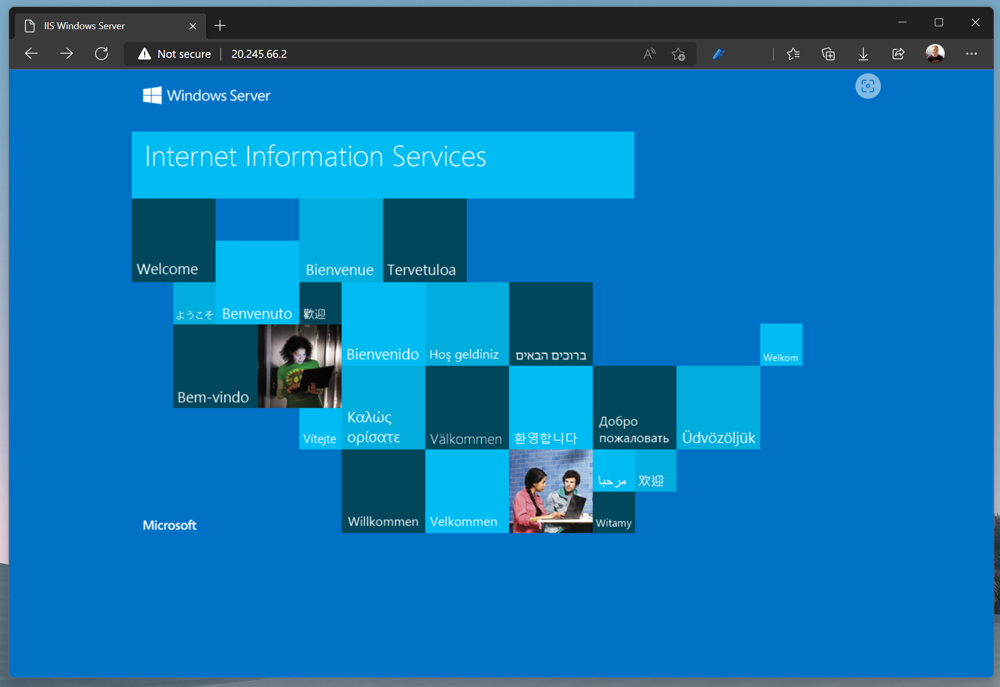

> L01-06

# Create Confidential Virtual Machine

Finally we will create a confidential virtual machine to run the Contoso HR web app. We will create the following resources.

| Resource | Description |
| -- | -- |
| Confidential Virtual Machine | DC2ASv5 size with AMD SEV-SNP support to host the Contoso HR web app |
| Virtual Network ||
| NSG (Network Security Group) | Allowing port 80 web (HTTP) traffic |
| Virtual Network Interface | To connect the VM to the virtual network |
| OS Disk | With user-managed key encryption |
| Azure Bastion | Remotely manage the VM securely |

> 😣 At the moment the Azure CLI does not support the creation of Confidential VMs so we will use ARM templates instead.

## Step 1 - Create a DES (Disk Encryption Set) to use the HSM key

First we will create a DES using the encryption key in the Managed HSM to encrypt the disk when we create the Confidential VM:

```powershell
# Get the Managed HSM ID
$hsmId = az keyvault show --hsm-name $hsmName --resource-group $rgName --query id

# Get the VM encryption key URL from the Managed HSM
$vmKeyUrl = ((az keyvault key show --hsm-name $hsmName --name $vmKeyName) | ConvertFrom-Json).key.kid

# Create a new Disk Encrytion Set
$desName = "desConfidentialVm"
$desArmTemplate = ".\Code\Lab 1 - Azure Resources\DiskEncryptionSetArm.json"

# Deploy the DES using an ARM template
az deployment group create `
    -g $rgName `
    -n dDiskEncryptionSet `
    -f $desArmTemplate `
    -p desName=$desName `
    -p region=$azLocation `
    -p encryptionKeyURL=$vmKeyUrl `
    -p encryptionKeyVaultId=$hsmId

# Get the ID of the new DES
$desId = (az disk-encryption-set show -n $desName -g $rgName --query [id] -o tsv)

# Get the service principal ID associated with the DES
$desIdentity=$(az disk-encryption-set show -n $desName -g $rgName --query [identity.principalId] -o tsv)

# Grant the DES service principal permission to use the key in the Managed HSM
az keyvault role assignment create `
   --hsm-name $hsmName `
   --role "Managed HSM Crypto Service Encryption User" `
   --scope /keys/$vmKeyName `
   --assignee $desIdentity
```

## Step 2 - Deploy the VM using an ARM template ☁️

Now we will deploy the Confidential VM using an ARM template.

```powershell
# Set the Id of the built-in "Confidential VM Orchestrator" service principal
$spCvmId = "bf7b6499-ff71-4aa2-97a4-f372087be7f0"

# Get the Id of the "Confidential VM Orchestrator"
$cvmAgentObjectId = (az ad sp show --id $spCvmId | Out-String | ConvertFrom-Json).id

# Grant the "Confidential VM Orchestrator" service principal permission to use the key in the Managed HSM
az keyvault role assignment create `
   --hsm-name $hsmName `
   --assignee $cvmAgentObjectId `
   --role "Managed HSM Crypto Service Release User" `
   --scope /keys/$vmKeyName

# Create Confidential VM ARM deployment using template
$deployName = "celAccHolCvm"
$vmName = "vmContosoWeb1"
$cvmArmTemplate = ".\Code\Lab 1 - Azure Resources\ConfidentialVmArm.json"

az deployment group create `
    -g $rgName `
    -n $deployName `
    -f $cvmArmTemplate `
    -p vmName=$vmName `
    -p vmSize="Standard_DC2as_v5" `
    -p osImageName="Windows Server 2022 Gen 2" `
    -p diskEncryptionSetId=$desID `
    -p securityType="DiskWithVMGuestState" `
    -p adminUsername="celAdmin" `
    -p adminPasswordOrKey="nooneWillEverGuessThis0ne!+$"
```

> 💡 Note that we are using the **Standard_DC2as_v5** VM Size so we can make use of the AMD SNP-SEV features to encrypt data in use.

## Step 3 - Add a Bastion to allow remote admin access to the VM

Create Bastion with native client support so we can connect and manage the VM using Remote Desktop.

```powershell
# Create a public IP address for the Bastion host
$bastionIpName = "bastionIp"

az network public-ip create `
   --resource-group $rgName `
   --name $bastionIpName `
   --sku Standard `
   --location $azLocation

# Extend vNet address spaces to contain the Bastion subnet
$vmVnetName = "$vmName-vnet"

az network vnet update `
   --resource-group $rgName `
   --name $vmVnetName `
   --address-prefixes 10.2.16.0/24 10.1.16.0/24

# Create the Bastion subnet
az network vnet subnet create `
   --address-prefixes 10.2.16.0/24 `
   --vnet-name $vmVnetName `
   --resource-group $rgName `
   --name "AzureBastionSubnet"

# Create the Bastion resource
$bastionName = "bVmContosoHrWeb"

az network bastion create `
   --name $bastionName `
   --public-ip-address $bastionIpName `
   --resource-group $rgName `
   --vnet-name $vmVnetName `
   --location $azLocation
```

> ⚠️ You need to enable native client support for your Bastion. Azure CLI or Powershell don't currently support this as native client support is still in preview, so you need to go to the Azure portal and navigate to the Configuration page for your Bastion resource. Check the box for Native Client Support and apply your changes.

Now you should be able to successfully RDP from your client into your confidential VM.

```powershell
 # Get the resource Id for the VM
 $vmId = (az vm show --resource-group $rgName --name $vmName | Out-String | ConvertFrom-Json).id

# Connect through RDP
 az network bastion rdp --name $bastionName --resource-group $rgName --target-resource-id $vmId
```

## Step 4 - Install a web server on the VM 🌐

Now the VM is up and running and we can remotely manage it, we can install the IIS (Internet Information Services) web server.

> ⚠️ Run this from you local PC

```powershell
# Install IIS on the VM
az vm run-command invoke `
   --resource-group $rgName `
   --name $vmName `
   --command-id RunPowerShellScript `
   --scripts "Install-WindowsFeature -name Web-Server -IncludeManagementTools"
```

Now that IIS is installed, the VM is a web server.

```powershell
# Get VM IP Address
$vmIpAddress = az network public-ip show --resource-group $rgName --name "$vmName-ip" --query ipAddress

$vmIpAddress
```

Open a Web browser and navigate to **http://your-vm-ip-here** and confirm that you see the default IIS web site:



## Step 5 - Allow connections from the VM to Azure SQL

```powershell
# Add SQL Server inbound firewall rule to allow connections from VM
az sql server firewall-rule create --resource-group $rgName --server $sqlServerName --name "Contoso HR Web VM" --start-ip-address $vmIpAddress --end-ip-address $vmIpAddress
```

---

We now have all the Azure resources in place and we're ready to deploy our HR data and application: [L02-01 Add HR Data](../Lab%202%20-%20HR%20Data/L02-01-CreateHrData.md)