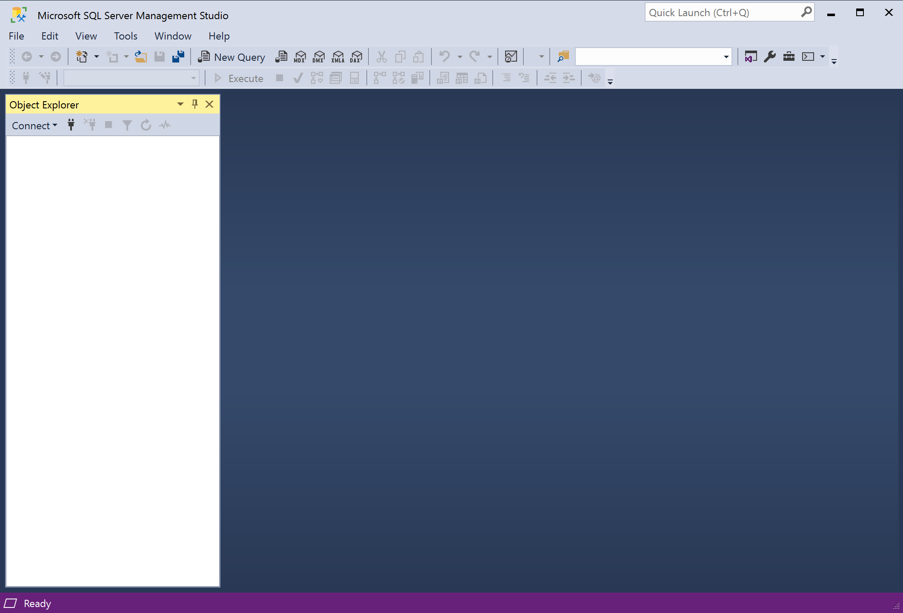
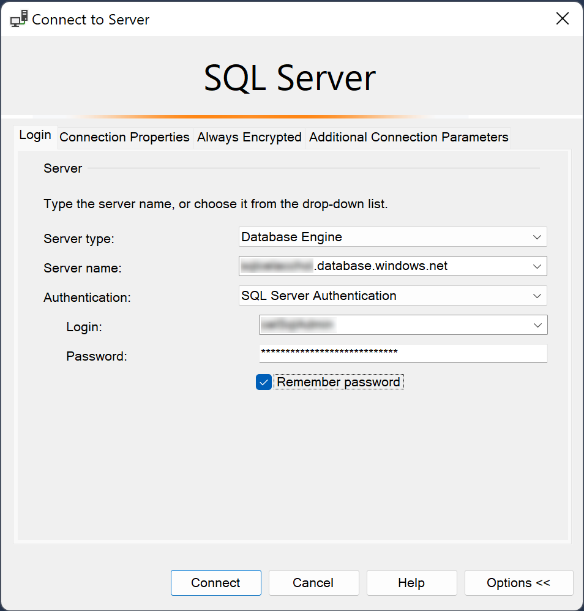
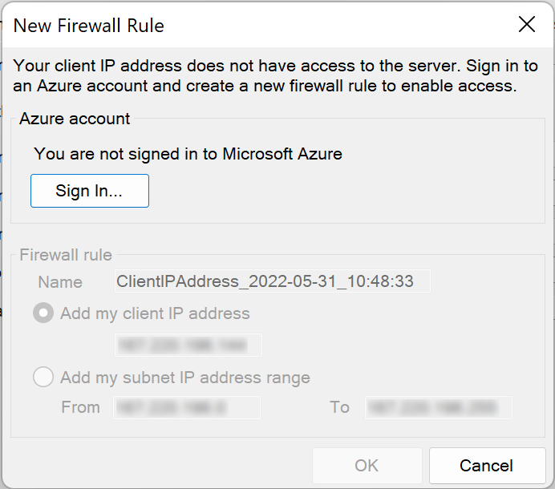
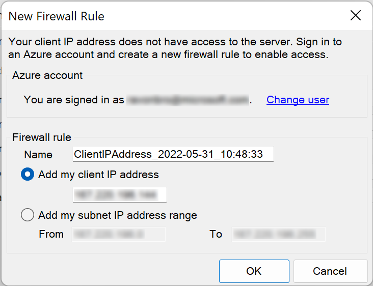

> L02-01
# Add HR data to database

Let's add our employee data to our Contoso HR database.

## Step 1 - Connect to Azure SQL
Launch *Sql Server Management Studio*



Connect to the Azure SQL logical server:

> ⚠️ you need to use your Azure SQL server name here.



Next you will be prompted to add a Firewall Rule to the Azure SQL logical server to allow connections from your PC:



Sign into your account and click **OK** to add the rule using the default values:



Now you're connected to Azure SQL and you should see the **Contoso HR** database in the Object Explorer pane on the left.


## Step 2 - Add HR data

In _Object Explorer_, right-click the "Contoso HR" database and select **New Query**.
Once the new query window connected to your database opens, paste the following SQL query:

```sql
CREATE SCHEMA [HR];
GO

CREATE TABLE [HR].[Employees]
    (
        [EmployeeID] [int] IDENTITY(1,1) NOT NULL,
        [SSN] [char](11) NOT NULL,
        [FirstName] [nvarchar](50) NOT NULL,
        [LastName] [nvarchar](50) NOT NULL,
        [Salary] [money] NOT NULL
    ) ON [PRIMARY];
GO

INSERT INTO [HR].[Employees]
    (
        [SSN]
        ,[FirstName]
        ,[LastName]
        ,[Salary])
    VALUES
    (
        '795-73-9838'
        , N'Catherine'
        , N'Abel'
        , $31692);

INSERT INTO [HR].[Employees]
        ([SSN]
        ,[FirstName]
        ,[LastName]
        ,[Salary])
    VALUES
    (
        '990-00-6818'
        , N'Kim'
        , N'Abercrombie'
        , $55415);
```

On the toolbar, select **Execute** to run the query which will create the *HR.Employees* table and add a 2 rows of data.

--
Now that the HR datat is ready, let's deploy the Contoso HR app to the web server: 