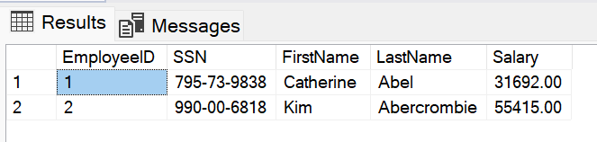

>L04-01

# Step 1 - Read employee data from the database

Now let's pretend that we're a curious Azure SQL admin.

Open the Sql Server Management Studio window.


In _Object Explorer_, right-click the "Contoso HR" database and select **New Query**.
Once the new query window connected to your database opens, paste the following SQL query:

```sql
SELECT * FROM HR.Employees
```

On the toolbar, select **Execute** to run the query and you will see the employee data we just added listed in the Results pane.



🔥⚠️ As you can see here the we can access sensitive employee data.

---

Next we will prevent this by encrypting the sensitive data using the key in the Managed HSM. [L04 02 Secure HR Data](L04-02-SecureHrData.md)