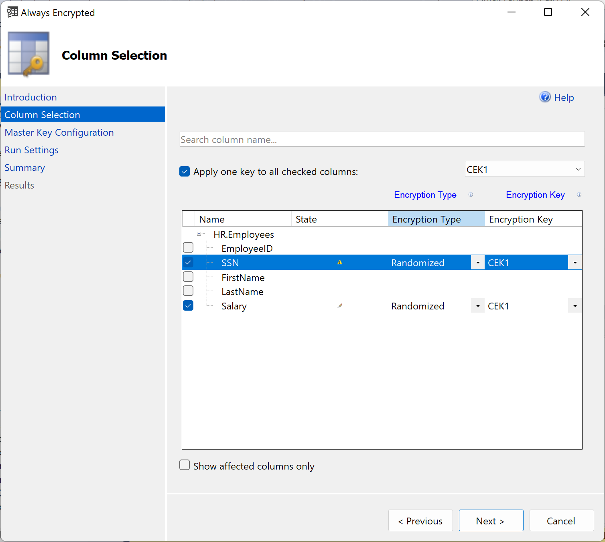
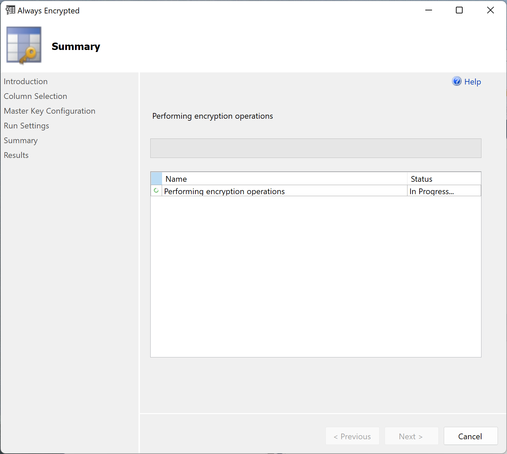
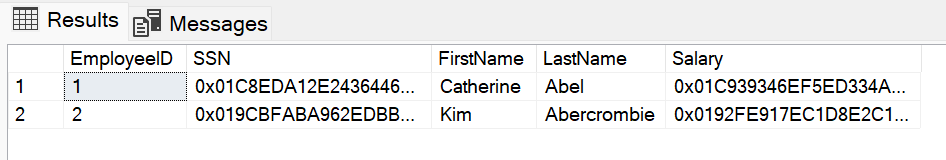
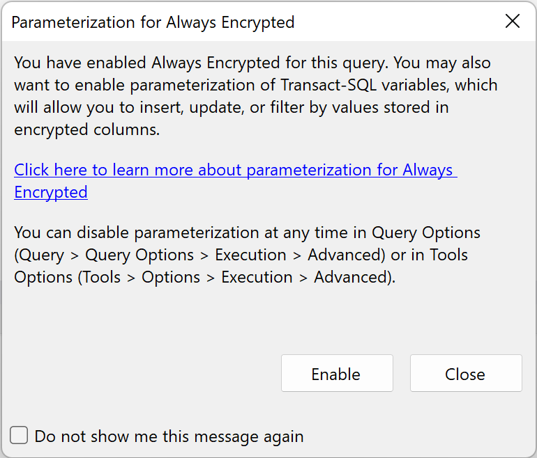
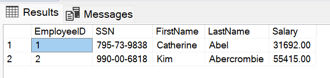

>L04-02

# Encrypt sensitive data in the database

To make sure we protect our sensitive employee data from curious database admins we will secure the sensitive **SSN** and **Salary** columns using [Always Encrypted with secure enclaves](https://docs.microsoft.com/en-us/sql/relational-databases/security/encryption/always-encrypted-enclaves).

Doing this means the sensitive data will only be decrypted in a secure enclave (Intel SGX) and presented to clients who have access to both the database and the keys in the Managed HSM.

## Step 1 - Prepare encryption keys

First thing we need to do is set up our SQL encryption keys. We need a Column Master Key (CMK) and a Column Encryption Key (CEK).

### 1.1 Create a CMK (Column Master Key)

- In _Object Explorer_, expand the "Contoso HR" database and navigate to **Security > Always Encrypted Keys**
- Right-click _Always Encrypted Keys_ and select **New Column Master Key**
- Complete the form with the below information:

        Name = CMK1
        Key store = Azure Key Vault
        Key store type = Managed HSM
        Allow enclave computations = True
        Select your existing key = kAzureSql

- Click **OK** to create the CMK

### 1.2 Create CEK (Column Encryption Key)

- Right-click _Always Encrypted Keys_ and select **New Column Encryption Key**
- Enter a name for the new column encryption key: **CEK1**
- In the _Column master key_ dropdown, select the column master key you created in the previous steps
- Click **OK** to create the CEK

## Step 2 - Encypt sensitive columns

Now that the encryption keys are ready we can use them to encrypt the data in the "SSN" and "Salary" columns.

- Right-click the _HR.Employee_ table and select **Encrypt Columns**
- In the *Always Encrypted* dialog choose the **SSN** and **Salary** columns

    

- Finish the wizard with the default values.

    > This will take few mins (about 5 mins for me) ⏱️
    
    

## Step 3 - Attempt to read employee data

- In _Object Explorer_, right-click the "Contoso HR" database and select **New Query**.
- Once the new query window connected to your database opens, paste the following SQL query:

    ```sql
    SELECT * FROM HR.Employees
    ```

- On the toolbar, select **Execute** to run the query and you will see the sensitive employee data has now been encrypted and can no longer be seen by the DBA.

    

    > 🛡️ Note that even though we are connected as the database administrator we can no longer see the sensitive data.

## Step 4 - Read employee data using the secure enclave

- Start a new instance of SSMS.

- In the _Connect to Server dialog_, specify the fully qualified name of your server (for example, myserver135.database.windows.net), and enter the administrator user name and the password you specified when you created the server.

- Click **Options** and select the **Connection Properties tab**.

- Select the **Contoso HR** database (not the default, master database)

- Select the **Always Encrypted tab**

    - Make sure the **Enable Always Encrypted (column encryption) checkbox** is selected

    - Specify your enclave attestation URL that you've obtained by following the steps in Step 2: Configure an attestation provider

- If you need a reminder of the Attestation service URL run this in Windows Terminal:

    ```powershell
    az attestation show `
    --resource-group $rgName `
    --name $attestName `
    --query attestUri
    ```

- Click **Connect**
- In _Object Explorer_, right-click the "Contoso HR" database and select **New Query**
- Once the new query window connected to your database opens, paste the following SQL query:

    ```sql
    SELECT * FROM HR.Employees
    ```

- On the toolbar, select **Execute** to run the query
- When you're prompted to enable Parameterization for Always Encrypted queries, select **Enable**

    

- Now you will see the sensitive employee data which has been processes in the secure enclave in the Results pane.

       

> 🛡️🔑 Now because we use the attestation service and our credentials have access to the to the encryption keys stored in the HSM, we can read the sensitive employee HR data.

---

🏅🏅🏅 That concludes the lab! 🏅🏅🏅

---

You can now Clean Up the resources to stop billing 💰 or you can complete Lab 5 which deploys a hello world app using Confidential Containers: [L05 01 AKS Cluster](./../Lab%205%20-%20Confidential%20Containers/L05-01-CreateAKSCluster.md)